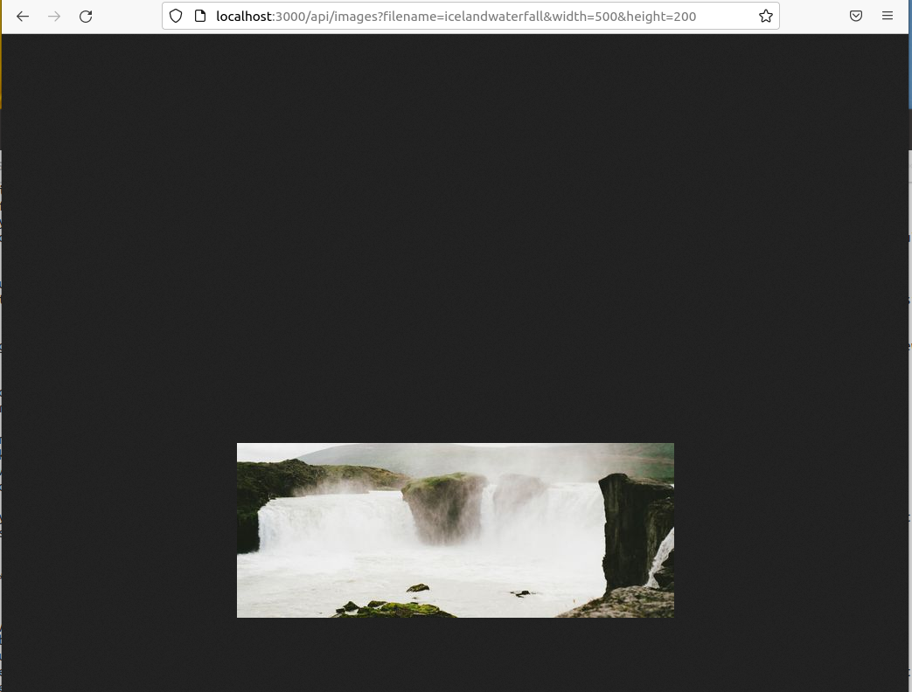

# Image Processing API
## Project Overview
The project was to build an API server that responds with resized image when user visits a route in the browser by specifying image filename, image width and image height as URL parameters.
## API Functionality
The Image Processing API handles resizing and serving stored images for the user.
* Accessing the URL with image information (such as image filename, width and height) in the query parameters should successfully resize an image and save it to disk on first access, then pull from disk on subsequent access attempts.
* An error message should be provided to the user when an image has failed to process or the image file does not exist.
## Technologies used
* `node.js` and `express` to build the server
* `typescript` to reduce type errors
* `jasmine` and `supertest` for unit testing
* `prettier` and `eslint` for formatting/linting
* `sharp` third-party module for image processing
## Project dependencies
Please refer dependencies, devDependencies and scripts section in [`package.json`](package.json) for more details.
## Installation setup and usage
### Install dependencies
* install all project dependencies with `npm install`
### Run development server
* start the development server with `npm start`. The start script uses nodemon.
### Run tests
* test scripts can be run using `npm run test`. The script first builds the project and then leverages jasmine for running tests with generated .js files.
### Run formatter/linter
* run code formatter with `npm run prettier`
* run eslint with `npm run lint`
### Build project and run the build server
* project can be build with `npm run build`. This compiles typescript to javascript, the .js files will get generated inside build folder.
* start the build server with `node build/index` or `node build/.`
The server runs on `http://localhost:3000/`

## API Request URL with query parameters
`http://localhost:3000/api/images?filename={specified_image_filename}&width={specified_image_width}&height={specified_image_height}`

Note: `specified_image_filename` is the name of any image file (without extension) that is available inside `images` folder. Currently the project only supports resizing of .jpg files
## Processed Image
The processed image with `specified_image_width` and `specified_image_height` gets generated inside `thumbnails` folder.

## API response as rendered on browser

## Author
Sayantani Chaudhuri